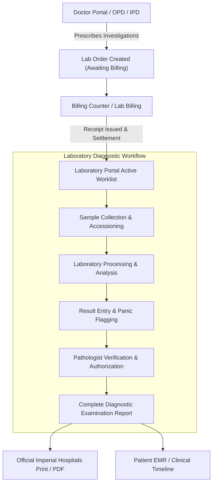
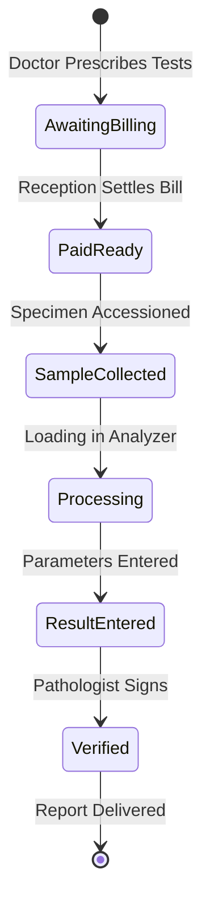
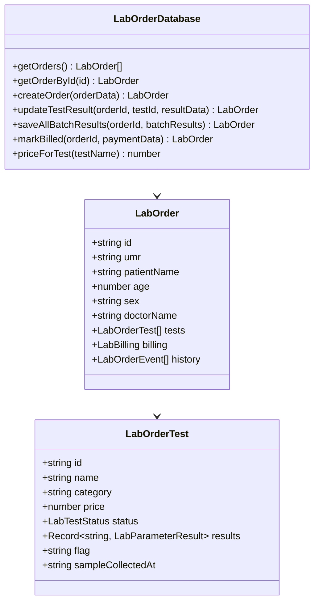

# Laboratory Module — Complete System Specification & Operational Flow

This document provides a comprehensive breakdown of the **Laboratory Diagnostic Module** within the Enterprise Hospital Management System (HMS), including its architecture, functional components, data lifecycle, clinical catalog, and user workflows.

---

## 1. Executive Overview

The **Laboratory Module** is an enterprise-grade diagnostic engine designed to handle the end-to-end processing of clinical investigations in both Outpatient (OP) and Inpatient (IP) hospital settings. It is integrated directly with the **Doctor Portal**, **Central Billing Counter**, and **Nursing Stations**, ensuring diagnostic compliance, billing auditability, and clinical precision.

---

## 2. Core Functional Modules & Architecture

### 2.1 File Map & Responsibilities

| File Path | Functional Responsibility |
| :--- | :--- |
| [`src/components/Laboratory.tsx`](src/components/Laboratory.tsx) | **Primary Laboratory Workspace**: Queue tabs, real-time statistics strip, search & filter engine, order queue worklist, and active patient investigation panel. |
| [`src/components/laboratory/labCatalogueSchema.ts`](src/components/laboratory/labCatalogueSchema.ts) | **Authoritative Diagnostic Master (206 Tests)**: Multi-parameter schemas, reference intervals, critical panic limits, units, sample types, turnaround times, and authentic hospital tariffs. |
| [`src/services/labOrdersDb.ts`](src/services/labOrdersDb.ts) | **Data Layer & State Engine**: Manages order creation, order deduplication, status transitions, rate card lookups, cross-service payment reconciliation, and cross-tab event broadcasting. |
| [`src/components/laboratory/TestCatalogModal.tsx`](src/components/laboratory/TestCatalogModal.tsx) | **Interactive Test Catalog**: Instant searchable modal for laboratory staff and clinicians to view test tariffs, specimen requirements, and reference ranges. |
| [`src/components/laboratory/TestResultModal.tsx`](src/components/laboratory/TestResultModal.tsx) | **Individual Test Result Entry**: Parameter-by-parameter entry with real-time numeric evaluation (`Normal`, `L`, `H`, `Critical`), flag computation, and technician notes. |
| [`src/components/laboratory/ImportAllResultsModal.tsx`](src/components/laboratory/ImportAllResultsModal.tsx) | **Batch Result Entry Interface**: High-velocity interface for entering all investigations ordered for a patient simultaneously in a single session. |
| [`src/components/laboratory/CompleteLabReportModal.tsx`](src/components/laboratory/CompleteLabReportModal.tsx) | **Official Diagnostic Report**: Formal printable report modeled directly on authentic hospital letterhead, featuring boxed demographics, 3-column parameters, abnormal asterisks, and pathologist signature stamp. |

---

## 3. End-to-End Diagnostic Lifecycle

### Step 1: Order Initiation
Investigations can be created via two pathways:
1. **Clinical Dispatch (Doctor Portal)**: During an OP or IP consultation, the physician orders laboratory tests. When the doctor clicks **Send Orders**, `consultationDispatch.ts` automatically splits medications to Pharmacy and investigations to the Laboratory via `LabOrderDatabase.createOrder()`.
2. **Direct Laboratory Counter Order**: Walk-in or urgent orders can be created directly within the Laboratory module using the **+ New Lab Order** modal.

### Step 2: The Billing Gatekeeper (Pre-Paid Settlement)
To prevent unauthorized consumption of reagents and ensure financial reconciliation:
- Newly created orders enter status `Pending` (Awaiting Billing).
- **Payment Enforcement**: The Laboratory worklist displays an amber banner: *"Payment Pending in Billing Desk: Investigations are listed as ordered by the doctor. Processing and verification are restricted until billing is settled."*
- Reception/Billing collects fees via `LabBillingQueue.tsx` or Central Billing. Once receipt is generated (`billing.status = "Paid"`), the order status unlocks, moving it to **Pre-Paid (Ready)**.

### Step 3: Specimen Accessioning & Processing
- The laboratory technician identifies the required specimen container based on the schema (e.g., `Lavender Top EDTA`, `SST Gel Clot Activator`, `Sodium Fluoride Gray Top`, `Sterile Container`).
- Barcode/UMR verification is validated against the patient's record.

### Step 4: Analytical Result Entry & Automated Flagging
Technicians enter observed values individually via `TestResultModal.tsx` or in bulk via `ImportAllResultsModal.tsx`.

The system executes automated evaluation on each numeric entry using `evaluateFlag()` in `labCatalogueSchema.ts`:
- **Normal Range**: Falls within `[low, high]`.
- **Low Flag (`▼ Low`)**: Value `< low`.
- **High Flag (`▲ High`)**: Value `> high`.
- **Panic Alert (`CRITICAL`)**: Value `< criticalLow` or `> criticalHigh`. Triggering this pulses a high-visibility badge on the order row and increments the clinic pulse counters.

### Step 5: Pathologist Verification & Authorization
- The Consultant Pathologist reviews the completed parameters, comparative reference ranges, and clinical history.
- The order transitions to `Verified` / `Completed`.

### Step 6: Diagnostic Report Generation & Printing
Clicking **Complete Laboratory Report** opens `CompleteLabReportModal.tsx`, formatting the output according to standard diagnostic stationery:
- Centered header: Hospital Name, Address, and Department.
- Bordered patient demographic box.
- Underlined uppercase test title (e.g., `COMPLETE BLOOD PICTURE`).
- 3-column diagnostic result alignment: `Investigation Parameter : [*] Observed Value Biological Reference Interval`.
- Asterisk indicator (`*`) automatically prefixed to any abnormal or out-of-range value.
- Sub-grouping for Differential Count (`DC`).
- Disclaimers, analyzer methodology (e.g., `Mindray BC-5150`), and authentic Pathologist rubber stamp & signature.

---

## 4. Test Catalog Architecture & Authentic Rate Card

The Laboratory Master (`labCatalogueSchema.ts`) contains **206 authentic diagnostic tests** grouped across **7 diagnostic departments**:

| Department / Module | Sub-Modules | Highlighted Investigations & Prices |
| :--- | :--- | :--- |
| **1. Hematology** | Complete Hemogram, Coagulation Profile, Hemolytic Workup, Bone Marrow | • CBC / Complete Hemogram (₹740) • Differential Count (₹150) • ESR (₹100) • PT / INR (₹450) • D-Dimer (₹1,500) • Platelet Count (₹150) |
| **2. Biochemistry** | Renal Profile (RFT/KFT), Liver Function (LFT), Lipid Profile, Diabetic Profile, Cardiac Markers, Electrolytes | • Fasting / Post-Lunch Blood Sugar (₹100) • HbA1c (₹550) • Liver Function Test (₹850) • Renal Function Test (₹750) • Serum Creatinine (₹200) • Lipid Profile (₹850) • Troponin-I (₹1,800) |
| **3. Clinical Pathology & Urinalysis** | Complete Urine Examination, Body Fluids (CSF, Pleural, Ascitic), Stool Analysis | • Complete Urine Examination / CUE (₹200) • Stool Routine & Occult Blood (₹250) • CSF Analysis (₹1,200) • Pleural Fluid Analysis (₹950) |
| **4. Microbiology & Serology** | Bacterial & Fungal Cultures, Infectious Serology (Dengue, Malaria, Typhoid), Viral Markers | • Blood / Urine / Sputum Culture & AST (₹1,200) • Dengue Duo NS1 / IgM (₹1,200) • Widal Test (₹250) • HIV 1 & 2 / HBsAg / HCV (₹500 each) |
| **5. Immunoassay & Endocrinology** | Thyroid Profile, Fertility & Reproductive Hormones, Vitamins, Tumor Markers | • Thyroid Profile T3/T4/TSH (₹650) • Vitamin D Total (₹1,500) • Vitamin B12 (₹1,200) • Serum Ferritin (₹850) • Serum Beta hCG (₹900) • PSA Total (₹1,100) |
| **6. Histopathology & Cytology** | Biopsy Processing, FNAC, Exfoliative Cytology | • Pap Smear (₹650) • FNAC Examination (₹850) • Small / Medium Biopsy (₹1,500–₹2,800) |
| **7. Special & Molecular Genetics** | Hemoglobinopathies, Autoimmune, Molecular Testing | • Hemoglobin Electrophoresis HPLC (₹1,800) • ANA by IFA (₹1,800) • Karyotyping (₹4,500) • HLA-B27 PCR (₹2,800) |

---

## 5. User Interface Design System

In compliance with hospital workstation requirements:
1. **Square / Sharp Border Aesthetic (`rounded-none`)**:
   - All cards, modal dialogs, queue buttons, input text boxes, select dropdowns, and statistics tiles use crisp `rounded-none` borders matching clinical laboratory terminal ergonomics.
2. **Real-Time Clinic Statistics Strip**:
   - Displays 5 live metrics: **Active Orders**, **Pre-Paid (Ready)**, **Awaiting Billing**, **Critical Alerts**, and **Completed & Signed**.
3. **Queue Segmentation**:
   - `All Orders`: Entire daily worklist.
   - `Pre-Paid (Ready)`: Billed orders cleared for sample intake and processing.
   - `Payment Pending`: Orders awaiting billing counter clearance.
   - `Critical Values`: Filtered strictly for orders with panic-level findings requiring immediate physician escalation.
   - `Completed & Verified`: Fully released diagnostic reports.

---

## 6. Data Integrity & Persistence Architecture

- **Persistence Storage**: `localStorage` key `hospai_lab_orders_v2`.
- **Multi-Tab Synchronization**: Real-time cross-tab synchronization using HTML5 `BroadcastChannel('hospai_lab_orders')`. Any result recorded or payment taken immediately updates open laboratory and physician dashboards without requiring page refreshes.
- **Audit Logging**: Every report generation and result verification is logged to `AuditDatabase` with user identity, timestamp, and patient identifier.

---

## 7. Summary

The Laboratory module delivers a closed-loop diagnostic workflow:
- **Doctors** prescribe tests with transparent pricing.
- **Billing** enforces revenue collection before analytical expenditure.
- **Laboratory Technicians** execute precision multi-parameter entries with automated reference flag detection.
- **Pathologists** sign off on standardized, professional laboratory reports ready for patient distribution.

